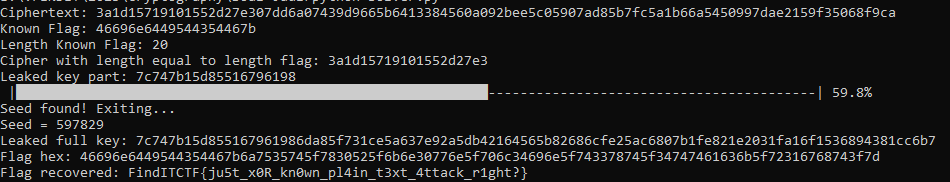

# Description
Bob wants to send a message to Alice. But he wants his messages to be safe until the message reach their destination so he creates encryption to protect them. However, Alice is confused about getting messages from Bob. Can you help her?

# Flag
FindITCTF{ju5t_x0R_kn0wn_pl4in_t3xt_4ttack_r1ght?}

# Solver Description
This message encrypted by XOR encryption. To decrypt a message that is encrypted by XOR, can be done with XORing the ciphertext with the key. To get the key, you can do a known plaintext attack because in the problem you know the bracket ```"FindITTCF{"```. So, the solution is: just do bruteforce known plaintext, then after obtaining the key, all you have to do is XOR it to the ciphertext and get the flag. Implementation is in [solver.py](./solver.py)


# Score
400