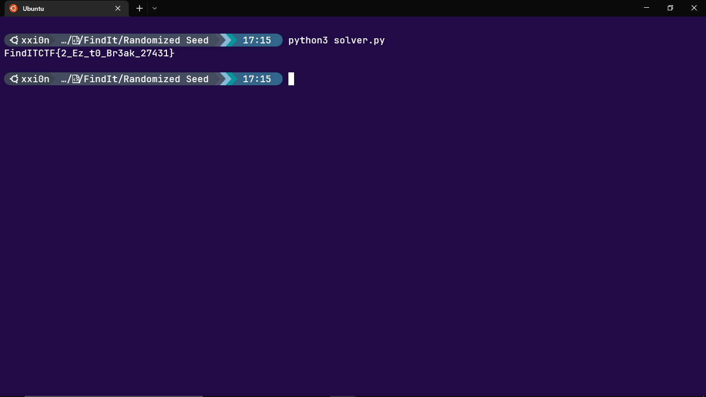

# Description
Yeah, we use randomzier

# Flag
FindITCTF{2_Ez_t0_Br3ak_27431}

# Solver Description
1. From the challenge.py we know that the seed randomizer is a 13 bit prime number. So, can just iterate every prime number before 8192 to get the seed and reverse the XOR operation to get the flag.

# Score
300

# Author
Arif ('saj#6550)