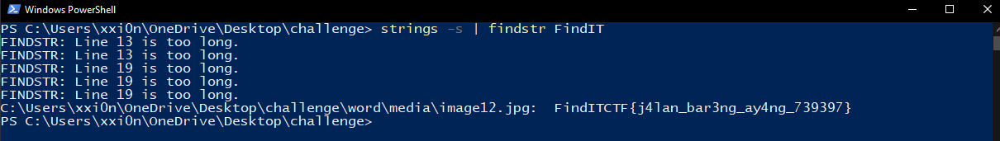

# Description
Suasana senja yang indah menjadi saksi perjalanan kami berdua, aku dan ayang. Kami berjalan bersama di atas jalan setapak yang mengelilingi taman kota yang ramai. Sinar matahari terbenam yang merah jambu menyinari wajah ayang yang cantik membuatku terpesona seketika. Kami berbicara tentang hal-hal kecil yang membuat hati kami senang dan tertawa bersama. Sambil berjalan, kami menyaksikan anak-anak yang bermain di taman dan memandang langit yang semakin gelap. Saat itulah aku merasa betapa beruntungnya aku memiliki ayang di sisiku, menjalani perjalanan hidup bersama-sama, berbagi cerita, bahagia dan sedih, serta saling mendukung satu sama lain. Perjalanan yang singkat tapi penuh makna bersama ayang membuatku merasa hidup ini lebih indah.

Anyway busway, this file header seem very familiar..... Perform Forensics Analysis to get the flag.

# Flag
FindITCTF{j4lan_bar3ng_ay4ng_739397}

# Solver Description
1. Using the hex editor, we spot that the file header starts with "PK" which indicates that the file is a .docx (MsWord) file. 
2. Because .docx file is structured so we can get all of the data when it's extracted, we can add .zip to the file extension to then extract the data.
3. When the data is extracted, we can perform Forensics Analysis using hex editor or Sysinternal's strings function (windows only).

# Score
300

# Author
Arif ('saj#6550)
