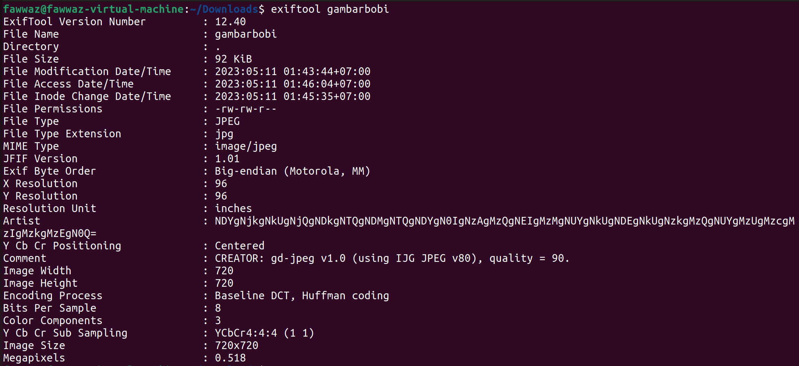

# Description
Adit yang baru terbangun dari tidurnya kaget karena melihat notifikasi deadline PR kalkulusnya dimajukan ke siang ini. Ia langsung menghubungi Bobi untuk menanyakan apakah dia sudah mengerjakan PR nya atau belum. Namun, Bobi hanya membalas dengan sebuah gambar. Hmmm, kira-kira ada apa ya dengan gambar yang dikirim Bobi?

# Flag
FindITCTF{p4K3_nAny4_57291}

# Solver Description
From the title of the problem, ```Me(me)tadata```, it gives a hint that this problem is about metadata. The participants can use the tools for viewing the metadata, such as ```exiftool```. If we look inside the metadata of the given .jpg file, we can see that the ```Artist``` section is a bit odd. It indicates a base64 encoding text. If we take that text and decode it with base64 decoder, we will get a hex. Using a hex to ASCII converter, we will obtain the flag.


# Score
150
