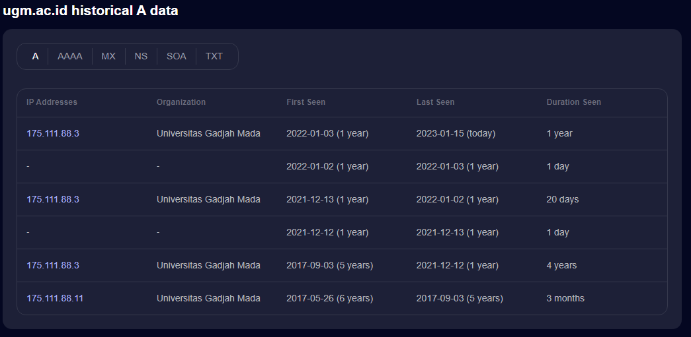

# Description
What was the ip address ugm.ac.id was hosted on 5 and a half year ago (2017-05-26 - 2017-09-03) ? Wrap your answer within the flag format: FindIT{}
PS. Bruteforcing the flag won't be accepted as a valid write-up

# Flag
FindITCTF{175.111.88.11}

# Solver Description
1. We can get the flag by looking up to ugm.ac.id IP history.
2. Although this may seem simple, looking up ugm.ac.id's historical data is really hard, trust me

# Score
150

# Author
Arif ('saj#6550)
