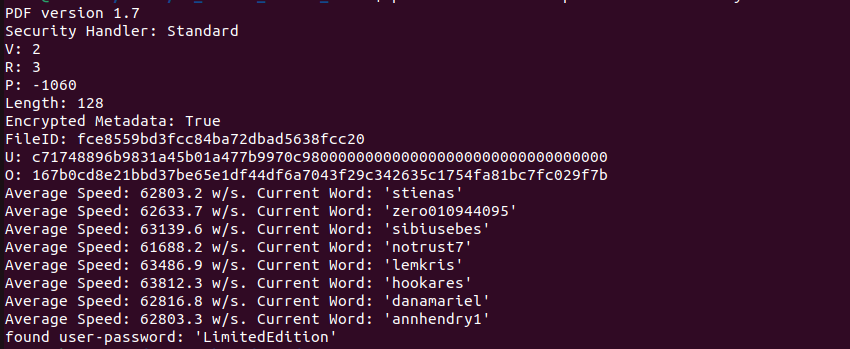
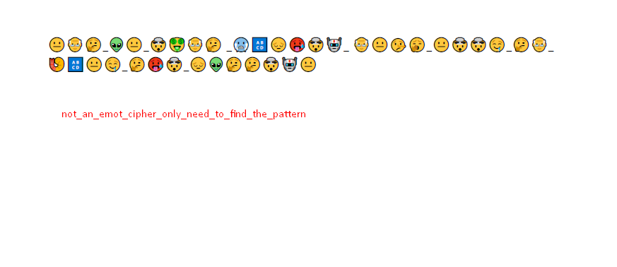

# Description
Bob finds a pdf file. He is sure there is important content in it but the pdf file is locked. Can you help him? (Bracket the flag with FindITCTF{})

# Flag
FindITCTF{not_an_emot_cipher_only_need_to_find_the_pattern}

# Solver Description
Crack the pdf using the bruteforce technique (can be using a wordlist ex: rockyou.txt), in the pdf there are emoticons where each emoticon represents one letter. Take the first letter of the emoticon name and get the flag (https://unicode.org/emoji/charts/full-emoji-list.html).  

# Score
200