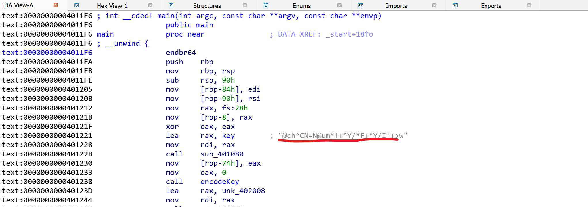
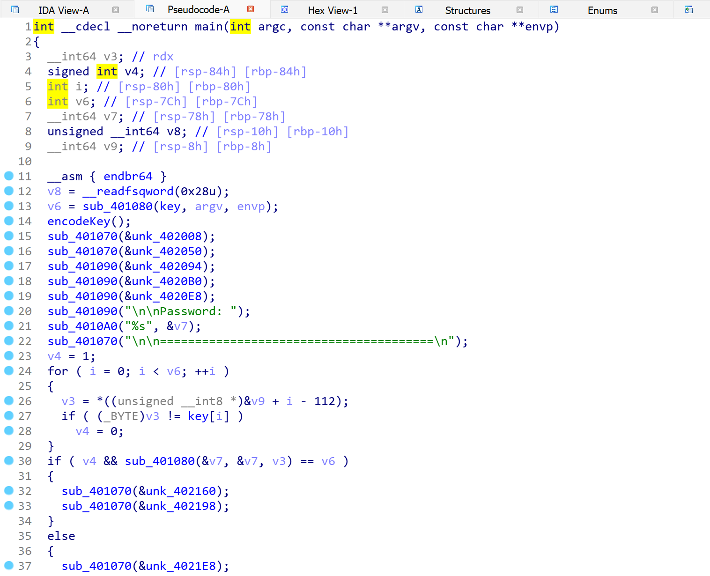
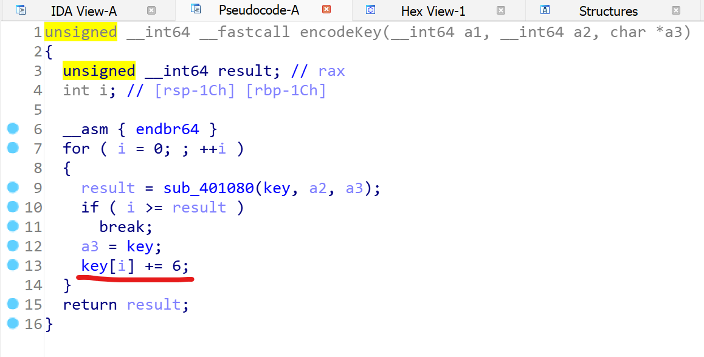

# Description
Sebuah pertemuan rahasia diadakan oleh perkumpulan Furry Indonesia di Land of Dawn. Sebagai anggota intelijen, kamu ditugaskan untuk mengikuti pertemuan tersebut untuk menguak rencana apa yang sedang mereka buat. Namun, untuk dapat mengikuti pertemuan itu, kamu harus mencari flag yang tepat agar bisa diijinkan masuk ke Land of Dawn. Bisakah kamu mencari flag itu? <br/>

# Flag
FindITCTF{s0l1d_50L1d_5Ol1D}

# Solver Description
The problem only provides a file ([ayojadifurry])(./ayojadifurry) and if we run ```file ayojadifurry```, we will get that the file is a 64-bit ELF file. Now, to solve this problem:
1. Open the file with a decompiler, in this case we use IDA.
2. On the main page, we will se a global variable as a string that is showed by IDA. 
3. Now, we try to generate the pseudocode for making the analysis easier by pressing ```f5``` button.
4. In the pseudocode section, we can see that the program has a function called ```encodeKey()```. 
5. If we jump into the function, we can see that the flag is equal to the global variable from the earlier step add by ```0x6```. 
6. The implementation for getting the flag can be seen here [implementation.c](./implementation.c)

# Score
200
